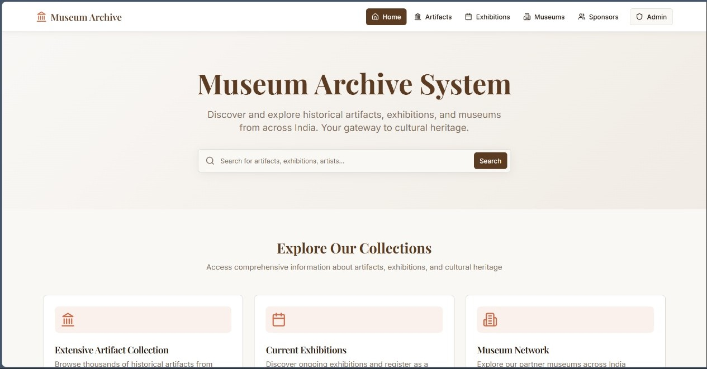

# ARTVAULT - DBMS PROJECT

ArtVault is a full-stack web application designed to manage and explore a comprehensive database of museum artifacts, exhibitions, and sponsors. It provides a public-facing interface for visitors to discover content and a secure admin dashboard for managing the system's data.


*(Screenshot of the application's home page)*

---

## 🚀 Features

### Public (Visitor) Features
* **Explore Artifacts:** Search and filter a vast collection of historical artifacts by name, origin, or era.
* **View Exhibitions:** Browse current and past exhibitions, sorted by their status (Ongoing/Closed).
* **Exhibition Details:** View detailed information for each exhibition, including visitor count, duration, and status.
* **Visitor Registration:** A public form allows visitors to register their attendance for specific exhibitions.
* **Museum Directory:** View a complete list of all partner museums, including their location and type.
* **Sponsor Registration:** A dedicated form for organizations to register their interest in sponsoring an exhibition.
* **Global Search:** A powerful search bar on the homepage to find artifacts, exhibitions, or museums from one place.

### Admin Features
* **Secure AdminLogin:** A separate login portal for system administrators.
* **Management Dashboard:** A central dashboard to manage all core data.
* **CRUD for Artifacts:** Admins can Create, Read, Update, and Delete all artifacts in the database.
* **CRUD for Exhibitions:** Admins can manage all exhibition details, including adding new ones.
* **CRUD for Museums:** Admins can add new partner museums and edit or remove existing ones.
* **Sponsorship Management:** Admins can view and manage pending sponsorship requests.

---

## 🛠️ Tech Stack

This project is built with a modern, full-stack architecture:

* **Frontend:**
    * **React** (with TypeScript)
    * **React Router:** For client-side routing.
    * **TanStack Query (React Query):** For server-state management, caching, and data fetching.
    * **shadcn/ui:** A component library used for the UI elements (Cards, Buttons, Dialogs, etc.).
    * **Lucide React:** For icons.

* **Backend:**
    * **Node.js**
    * **Express.js:** As the web server framework.
    * **CORS:** For handling cross-origin requests from the React frontend.

* **Database:**
    * **MySQL:** A relational database to store all application data.
    * **Custom SQL Functions:** The database includes functions like `fn_exhibition_visitor_count` and `fn_exhibition_duration_days` to compute data live.

---

## 🚀 Database Setup (First-Time Only)

Before running the application, you must set up the MySQL database and user.

1.  Log in to your MySQL server as a **`root`** user.
2.  Run the following commands to create a new user named `museum` with the password `ArtVault` and give it full permissions on your new database:

    ```sql
    CREATE DATABASE museum_db;
    
    CREATE USER 'museum'@'localhost' IDENTIFIED BY 'ArtVault';
    GRANT ALL PRIVILEGES ON museum_db.* TO 'museum'@'localhost';
    FLUSH PRIVILEGES;
    ```

3.  Once the user is created, you can run the main setup script to create all the tables and insert the data:

    ```bash
    # Log in as the new user
    mysql -u museum -p museum_db < museum_db.sql
    
    # (Enter 'ArtVault' when prompted for the password)
    ```

---

## ⚙️ Local Development Setup

Follow these steps to run the project locally.

### 1. Backend Setup

1.  Navigate to the directory containing `server.js`.
2.  Install the required `npm` packages:
    ```bash
    npm install express mysql2 cors
    ```
3.  The `server.js` file is hard-coded to use the credentials from the Database Setup. If you used a different username, password, or database name, update the `dbConfig` object in `server.js`.
4.  Start the backend server:
    ```bash
    node server.js
    ```
    The server should now be running at `http://localhost:3001`.

### 2. Frontend Setup

1.  Open a **new terminal** and navigate to the frontend project directory (the one with `App.tsx` and `package.json`).
2.  Install the required `npm` packages:
    ```bash
    npm install
    ```
3.  Start the React development server (this command may be `npm run start` depending on your setup):
    ```bash
    npm run dev
    ```
    The application will open in your browser, likely at `http://localhost:8080`.

### 3. Admin Credentials

You can now access the admin panel at `/admin/login`. Use the credentials from the `museum_db.sql` script:

* **Username:** `admin1`
* **Password:** `ArtVault`